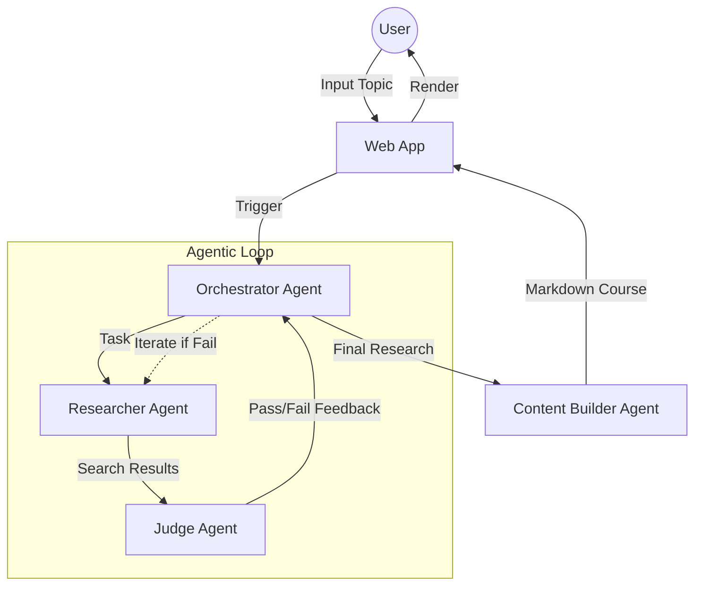

# ✨ Agentic Course Creator

[](https://www.python.org/)
[](https://cloud.google.com/vertex-ai)
[](https://fastapi.tiangolo.com/)

> **A distributed multi-agent system that transforms any topic into a comprehensive, fact-checked educational course in seconds.**

Turn your curiosity into knowledge. This project leverages the **Google Agent Development Kit (ADK)** and the **A2A (Agent-to-Agent) protocol** to orchestrate a team of specialized AI microservices that research, evaluate, and build structured learning content.

---

## 🏛️ Architecture & Orchestration

The system follows a distributed microservice pattern where each agent acts as an autonomous service communicating via the A2A protocol.



---

## 🚀 Key Features

- **Autonomous Research Loop**: A specialized **Judge Agent** evaluates the output of the **Researcher Agent**, triggering recursive research iterations if quality thresholds aren't met.
- **A2A Protocol Implementation**: Industry-standard agent-to-agent communication using Google's latest ADK framework.
- **Microservice Scalability**: Each agent (Researcher, Judge, Content Builder) is containerized and can be deployed independently.
- **Premium User Experience**: A modern, dark-mode dashboard featuring:
  - Real-time agent status tracking.
  - Dynamic Markdown rendering with automatic Table of Contents.
  - High-performance SSE (Server-Sent Events) for live feedback.

---

## 🛠️ Tech Stack

- **Core**: Python 3.10+, FastAPI, Uvicorn.
- **AI/ML**: Google Vertex AI (Gemini 2.5), Google ADK.
- **Infrastructure**: Docker, A2A Protocol, Google Identity Tokens (OIDC).
- **Frontend**: Vanilla JS (ES6+), Modern CSS (Gradients, Glassmorphism, Animations), Marked.js.

---

## 🚦 Getting Started

### 1. Prerequisites
- [Google Cloud Project](https://console.cloud.google.com/) with Vertex AI API enabled.
- [gcloud CLI](https://cloud.google.com/sdk/docs/install) authenticated.
- [uv](https://github.com/astral-sh/uv) (recommended) or `pip`.

### 2. Installation
```bash
git clone https://github.com/yourusername/agentic-course-creator.git
cd agentic-course-creator
cp .env.example .env # Add your Google Cloud Project ID
```

### 3. Run the System
The system is distributed, so you'll need to start the agents in separate terminals:

```bash
# Terminal 1: Researcher (Port 8001)
cd agents/researcher && uv run python3 adk_app.py --port 8001 --a2a

# Terminal 2: Judge (Port 8002)
cd agents/judge && uv run python3 adk_app.py --port 8002 --a2a

# Terminal 3: Content Builder (Port 8003)
cd agents/content_builder && uv run python3 adk_app.py --port 8003 --a2a

# Terminal 4: Orchestrator (Port 8080)
cd agents/orchestrator && uv run ./run.sh --port 8080 --a2a

# Terminal 5: Web App (Port 8000)
cd app && uv run python3 main.py
```

---

## 🧠 Meet the Agents

| Agent | Responsibility | Tools/Capabilities |
| :--- | :--- | :--- |
| **Researcher** | Fact-finding and data gathering. | Google Search Tool, Web Scraping. |
| **Judge** | Quality control and fact-checking. | Pydantic Schema Validation, Critical Reasoning. |
| **Content Builder** | Educational content creation. | Markdown formatting, Pedagogical Structuring. |
| **Orchestrator** | Workflow management. | LoopAgent, SequentialAgent, Escalation Logic. |

---

## 📄 License

Distributed under the MIT License. See `LICENSE` for more information.

---

<p align="center">
  Built with ❤️ using the Google Agent Development Kit
</p>
